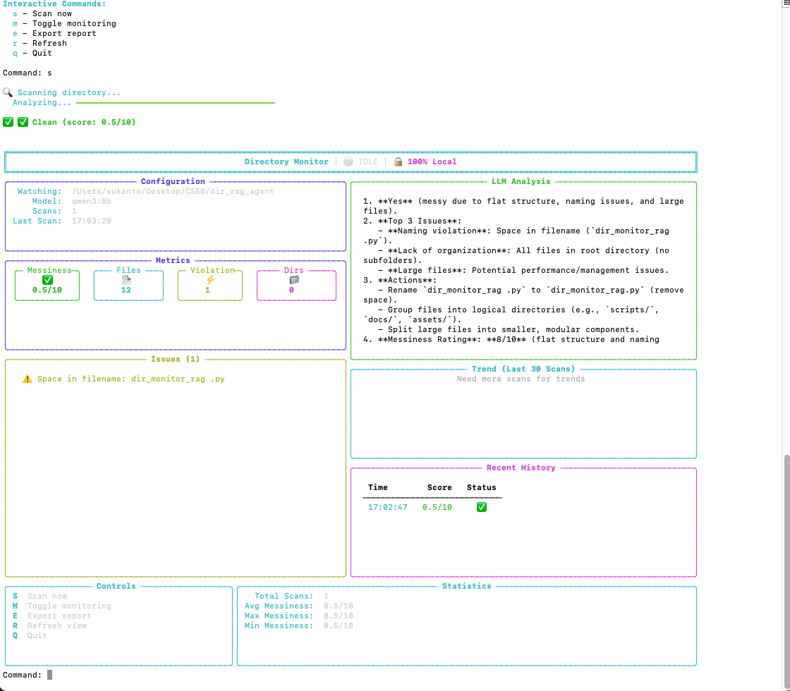
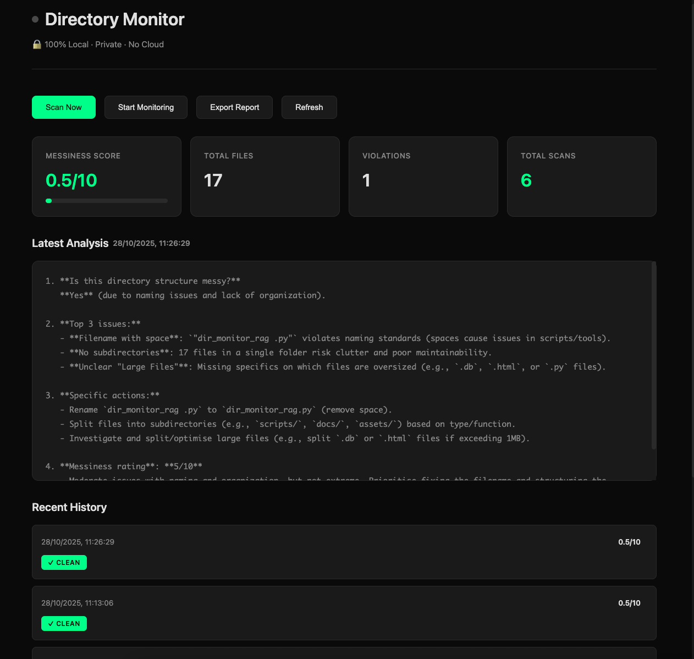

[](https://github.com/sukanto-m/directory-monitor)
[](https://github.com/sukanto-m/directory-monitor)

# 🔒 Directory Monitor

**AI-powered directory organization monitoring - 100% local, completely private**

[](https://www.python.org/downloads/)
[](https://opensource.org/licenses/MIT)
[](https://ollama.ai)
[](#privacy)

> Keep your projects organized with AI recommendations - without sending any data to the cloud.

[Features](#features) • [Demo](#demo) • [Quick Start](#quick-start) • [Why Local?](#why-local) • [Usage](#usage) • [Contributing](#contributing)

---

## ✨ Features

- 🤖 **Local LLM Analysis** - Uses Ollama (Qwen/Llama) to analyze your directory structure
- 📊 **Beautiful Terminal UI** - Real-time metrics with Rich, sparkline trends
- 🌐 **Minimalist Web UI** - Clean, dark-themed web interface
- 📈 **Trend Tracking** - Monitor messiness over time with historical analysis
- 🎯 **RAG with Local Embeddings** - Learns from your directory patterns using sentence-transformers
- 💾 **SQLite Database** - All history stored locally, portable
- 🔒 **100% Private** - Zero cloud APIs, no telemetry, no data collection
- ⚡ **Real-time Alerts** - Get notified when your directories need attention
- 🎨 **Customizable Standards** - Define your own organization rules

## 🎬 Demo

### Terminal UI
> Beautiful, interactive terminal interface with live metrics



### Web UI
> Clean, modern web interface at http://localhost:5000



**Example Analysis:**
```
✅ Messiness Score: 2.8/10 - Very Clean!

Top 3 Issues:
1. Space in filename: docs/New File.md - use hyphens instead
2. Too many files (28) in src/components - split into ui/, forms/, layouts/
3. Large file: data/export.csv (145MB) - add to .gitignore

Recommended Actions:
- Rename files with spaces to use kebab-case
- Organize src/components by feature
- Review large files for version control exclusion

Trend: 📉 Improving (was 7.8, now 2.8)
```

## 🚀 Quick Start

### Prerequisites

- Python 3.9+
- 8GB+ RAM recommended
- macOS, Linux, or Windows

### Installation

```bash
# 1. Clone the repository
git clone https://github.com/sukanto-m/directory-monitor.git
cd directory-monitor

# 2. Create virtual environment
python3 -m venv venv
source venv/bin/activate  # On Windows: venv\Scripts\activate

# 3. Install dependencies
pip install -r requirements.txt

# 4. Install Ollama (for local LLM)
curl -fsSL https://ollama.com/install.sh | sh  # macOS/Linux
# Windows: Download from https://ollama.com/download

# 5. Pull an LLM model
ollama pull qwen2.5:latest
# Or: ollama pull llama3.2:latest
# Or: ollama pull codellama:latest
```

### Run

```bash
# Terminal UI (recommended)
python monitor_tui.py

# Web UI
python monitor_ui.py
# Then open http://localhost:5000

# View trends
python trend_graphs.py --days 30
```

## 🎯 Why Local?

**Privacy Matters**

- ❌ **Cloud-based tools** send your directory structure to third parties
- ❌ **Proprietary AI** requires API keys and usage tracking
- ❌ **Your data** ends up in training datasets

**With Directory Monitor:**

- ✅ Everything runs on your machine
- ✅ No API keys, no accounts, no tracking
- ✅ Your directory structure never leaves localhost
- ✅ Works offline after initial setup
- ✅ GDPR/compliance friendly

## 📖 Usage

### Basic Monitoring

```bash
# Monitor current directory
python monitor_tui.py

# Monitor specific directory
python monitor_tui.py --path /path/to/project

# Use different model
python monitor_tui.py --model llama3.2:latest
```

### Terminal UI Commands

| Key | Action |
|-----|--------|
| `s` | Scan directory now |
| `m` | Toggle continuous monitoring (every 5 min) |
| `e` | Export JSON report |
| `r` | Refresh display |
| `q` | Quit |

### Web UI

```bash
# Start server
python monitor_ui.py --port 5000

# Custom configuration
python monitor_ui.py --path ~/projects --model qwen2.5:7b --port 8080
```

### Programmatic Usage

```python
from directory_monitor import AgenticMonitor

# Initialize monitor
monitor = AgenticMonitor(
    watch_path="./my_project",
    model_name="qwen2.5:latest"
)

# Run single scan
result = monitor.scan_and_alert(alert_threshold=5.0)

print(f"Messiness: {result['messiness_score']}/10")
print(f"Analysis: {result['llm_analysis']}")

# Export report
monitor.export_report("report.json")

# Get statistics
stats = monitor.get_statistics()
print(f"Average messiness: {stats['avg_messiness']}/10")
```

## 🎨 Customization

### Define Your Own Standards

Create `monitor_config.json`:

```json
{
  "max_depth": 5,
  "max_files_per_dir": 20,
  "forbidden_patterns": [
    "temp", "backup", "old", "copy", "untitled"
  ],
  "recommended_structure": [
    "src/", "tests/", "docs/", "config/", "scripts/"
  ],
  "file_naming": {
    "no_spaces": true,
    "lowercase_preferred": true
  },
  "max_file_size_mb": 100
}
```

The monitor will automatically load your custom standards on startup.

### Ignore Patterns

By default, these are ignored:
- `.git`, `__pycache__`, `node_modules`
- `.venv`, `venv`, `dist`, `build`
- `.next`, `.cache`, `target`

Customize in `DirectoryAnalyzer.scan_directory()`.

## 📊 Models

Choose the right model for your hardware:

| Model | Size | RAM | Speed | Quality | Use Case |
|-------|------|-----|-------|---------|----------|
| `qwen2.5:7b` | 4.7GB | 8GB+ | Fast | Good | Quick checks |
| `qwen3:8b` | 5.2GB | 8GB+ | Fast | Very Good | Balanced Performance |
| `llama3.2:latest` | 7GB | 8GB+ | Medium | Very Good | General purpose |
| `codellama:latest` | 7GB | 16GB+ | Medium | Great | Code-focused |

```bash
# Pull a model
ollama pull qwen2.5:7b

# List installed models
ollama list

# Use specific model
python monitor_tui.py --model qwen2.5:7b
```

## 🔧 How It Works

```
┌─────────────────────────────────────────────┐
│         Your Machine (100% Local)           │
├─────────────────────────────────────────────┤
│                                             │
│  1. Scan Directory Structure                │
│     ↓                                       │
│  2. Store in SQLite Database                │
│     ↓                                       │
│  3. Generate Embeddings (local)             │
│     ↓                                       │
│  4. Query Local LLM (Ollama)                │
│     ↓                                       │
│  5. RAG: Retrieve Similar Past States       │
│     ↓                                       │
│  6. Generate Analysis & Recommendations     │
│     ↓                                       │
│  7. Display Results & Track Trends          │
│                                             │
└─────────────────────────────────────────────┘
```

**Key Technologies:**

- **Ollama** - Local LLM inference
- **sentence-transformers** - Local text embeddings
- **SQLite** - Local database
- **Rich** - Terminal UI
- **Flask** - Web UI (local server)

## 📁 Project Structure

```
directory-monitor/
├── directory_monitor.py      # Core monitoring engine
├── monitor_tui.py            # Terminal UI
├── monitor_ui.py             # Web UI
├── trend_graphs.py           # Trend analysis & visualization
├── requirements.txt          # Python dependencies
├── README.md                 # This file
├── .gitignore               # Git ignore rules
├── directory_monitor.db      # SQLite database (auto-created)
└── monitor_config.json       # Custom standards (optional)
```

## 🤝 Contributing

Contributions welcome! Here's how:

1. Fork the repository
2. Create a feature branch (`git checkout -b feature/amazing-feature`)
3. Commit your changes (`git commit -m 'Add amazing feature'`)
4. Push to the branch (`git push origin feature/amazing-feature`)
5. Open a Pull Request

**Ideas for contributions:**
- Additional LLM model support
- More visualization options
- Integration with Git for commit-based tracking
- Additional export formats (CSV, HTML)
- Language-specific standards (Python, JavaScript, etc.)
- Mobile app/PWA

## 🐛 Troubleshooting

### "Ollama connection refused"

```bash
# Check if Ollama is running
ollama list

# Start Ollama
ollama serve
```

### "Model not found"

```bash
# Pull the model
ollama pull qwen2.5:latest

# Verify
ollama list
```

### "No module named 'sentence_transformers'"

```bash
# Activate virtual environment
source venv/bin/activate

# Reinstall dependencies
pip install -r requirements.txt
```

### Slow Performance

- Use a smaller model: `qwen2.5:7b` or `llama3.2:latest`
- Reduce scan frequency
- Add more directories to ignore list

## 📝 License

MIT License - see [LICENSE](LICENSE) file for details.

## 🙏 Acknowledgments

- Built with architectural guidance from Claude AI (Anthropic)
- Inspired by the local-first AI movement
- Thanks to the Ollama team for making local LLMs accessible

## 🌟 Star History

If you find this useful, please consider giving it a star! ⭐

## 📬 Contact

- **GitHub Issues**: [Report bugs or request features](https://github.com/sukanto-m/directory-monitor/issues)
- **Discussions**: [Join the conversation](https://github.com/sukanto-m/directory-monitor/discussions)

---

<div align="center">

**[⬆ back to top](#-directory-monitor)**

Made with ❤️ for developers who value privacy

🔒 **100% Local** • 🚀 **Always Free** • 🌍 **Open Source**

</div>
